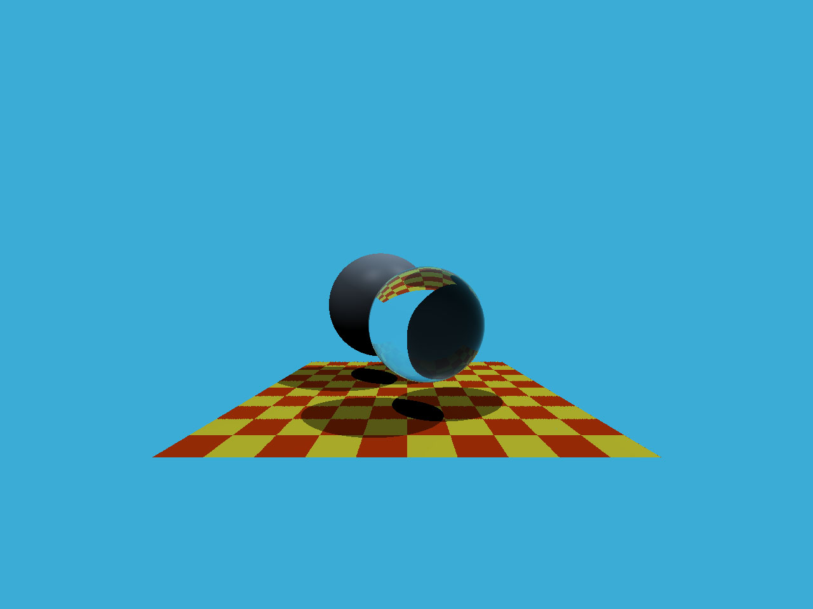

## Whitted style ray tracing

### References
[1] [Möller Trumbore Algorithm](https://sites.cs.ucsb.edu/~lingqi/teaching/resources/GAMES101_Lecture_13.pdf) : Ray intersection with triangles, giving barycentric coordinate directly.
