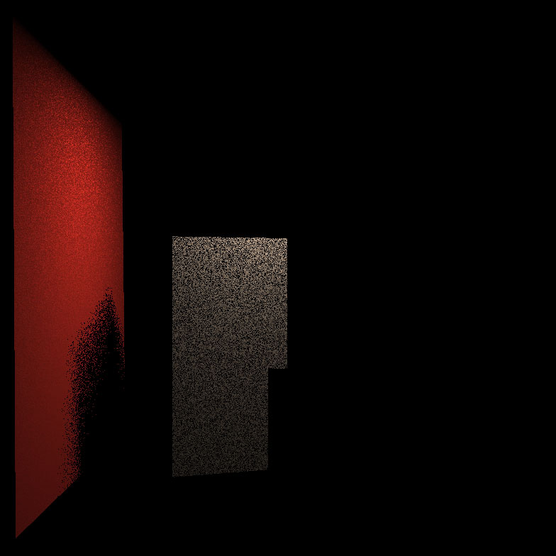
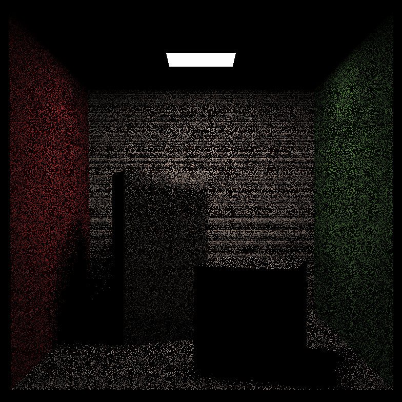
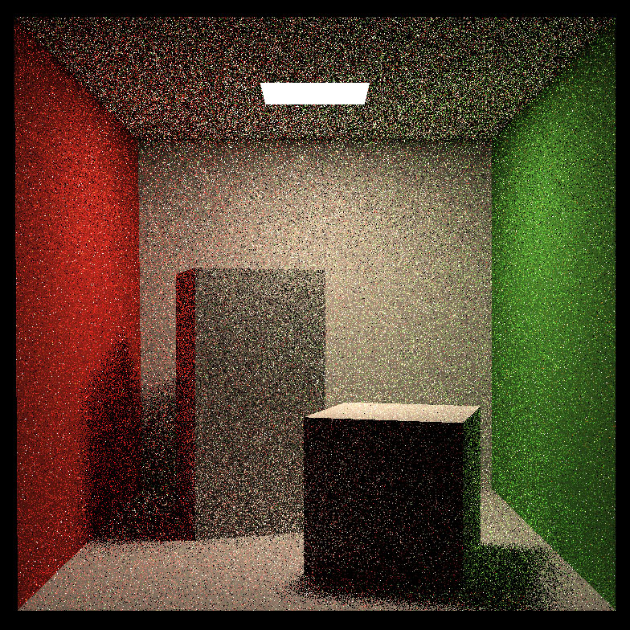
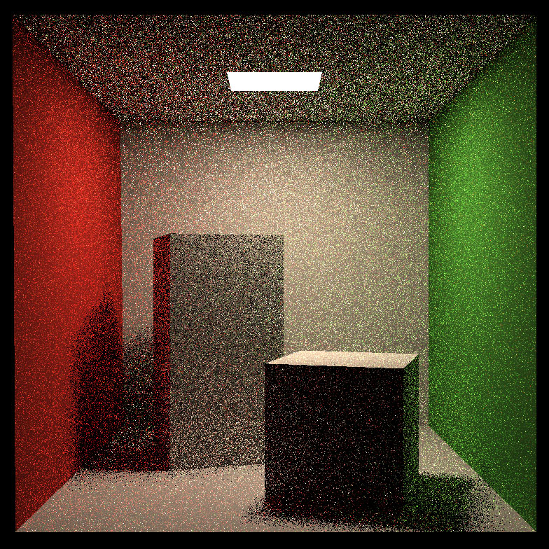
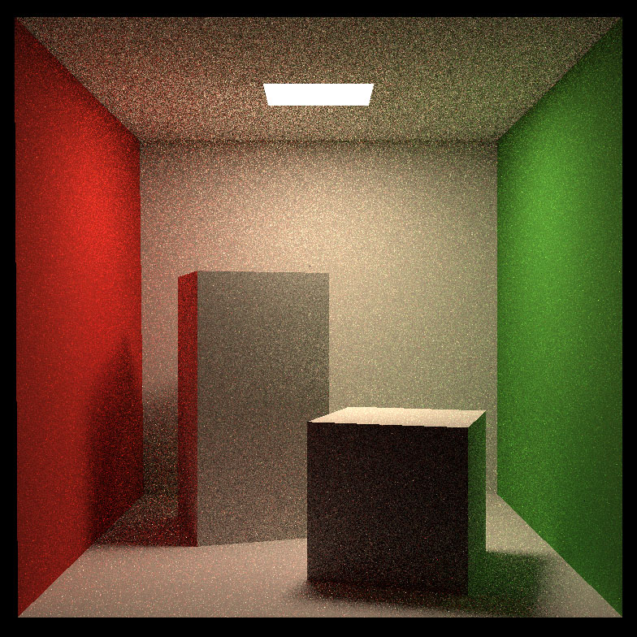

## Path Tracing

Implement path tracing with Monte Carlo integration and Russian Roulette scheme, sampling from lights.

### Common mistakes

| Descriptions | Rendering Results (1spp) |
| --- | --- |
| <b>Mistake</b>: Planes are not rendered.    <b>Reason</b>: The bounding box of a plane is also a plane. Be careful processing a ray intersection with a plane. ||
| <b>Mistake</b>: Black lines.    <b>Reason</b>: Numerical errors. Give a tolerance when check if light is blocked by obstacles. ||
| <b>Mistake</b>: Brightened noisy points.    <b>Reason</b>: Bugs cause the value of light intensity too large. ||

### Rendering results 

| 1spp | 16spp |
| --- | --- |
| | |

### References
[1] [Rending Equation](https://sites.cs.ucsb.edu/~lingqi/teaching/resources/GAMES101_Lecture_15.pdf)

[2] [Monte Carlo Integration and Path Tracing](https://sites.cs.ucsb.edu/~lingqi/teaching/resources/GAMES101_Lecture_16.pdf)
